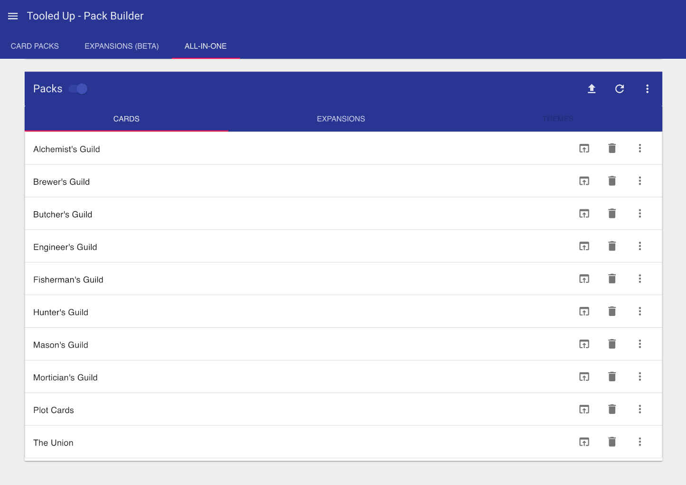
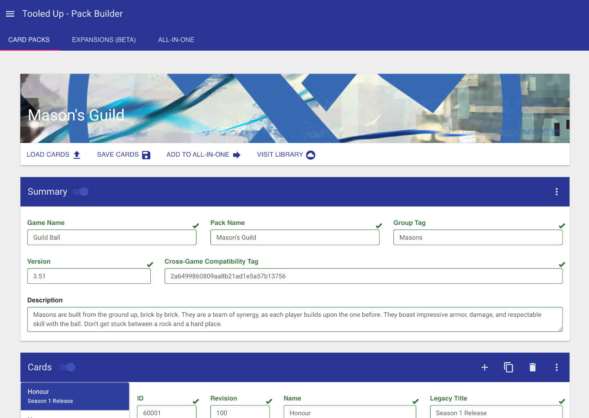
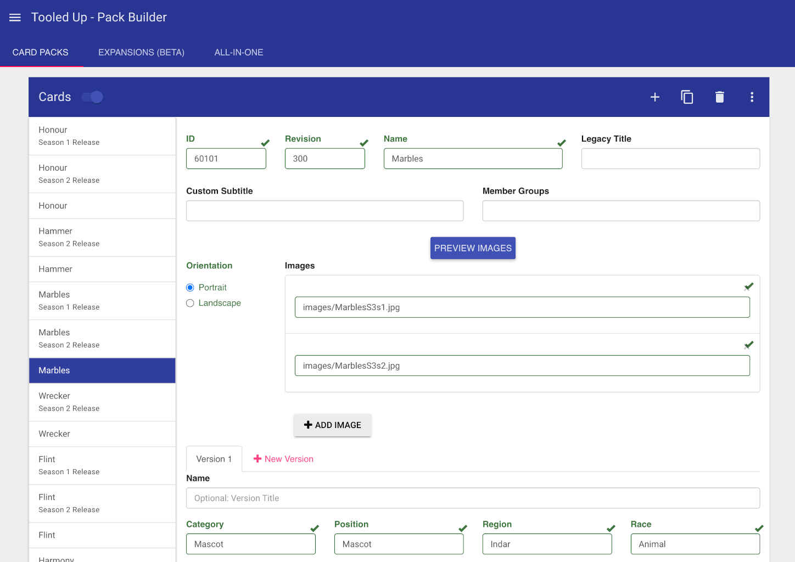
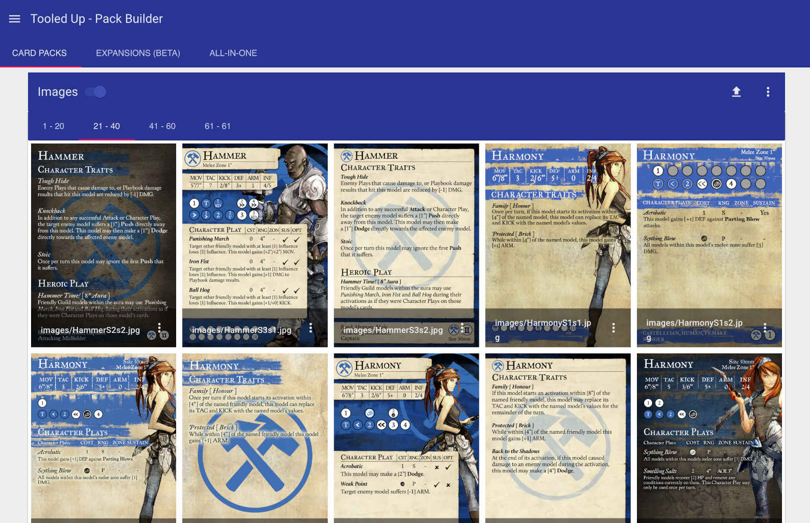

# Tooled Up - Builder

> **Note**: This project is no longer actively maintained and no support is provided. It was originally started
as a hobby, along with Tooled Up - Gaming Manager, in order to fill a gap in the tabletop gaming industry for
mobile applications. It has many examples for processing images, JSON, web apps, compression, web workers, etc.,
so it remains available for referencing.

Tooled Up - Builder is a frontend web based application to allow easy editing of "Packs" which are used with the
Android application Tooled Up - Gaming Manager.

Packs are a combination of JSON, PDFs, and image files, packaged into a compressed zip file with custom extensions.
This builder supports editing the following types of packs:
- Card Pack (.cpak) - Packs of cards shared among a Tabletop Game
- Expansion Pack (.xpak) - Collection of various items including Score Trackers, Chess Clocks, Game Manuals, etc
- All In One Pack (.apak) - Combination of Expansion, Card, and Theme packs which can be used to install all packs onto local device from a single file

To install the primary application, visit the following:  
[Google Play: Tooled Up - Gaming Manager](https://play.google.com/store/apps/details?id=com.solaristudios.decker)

### How to Run Locally:
1. Clone/pull the repository.
2. Use simple Python server from root of repository:
`python3 -m http.server`

### This project is hosted online at the following:  
[Tooled Up - Builder](http://tooledup.solaristudios.com/builder/)

### Previews

